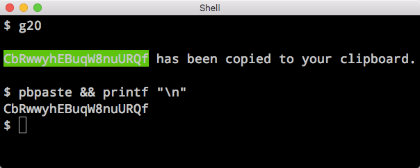
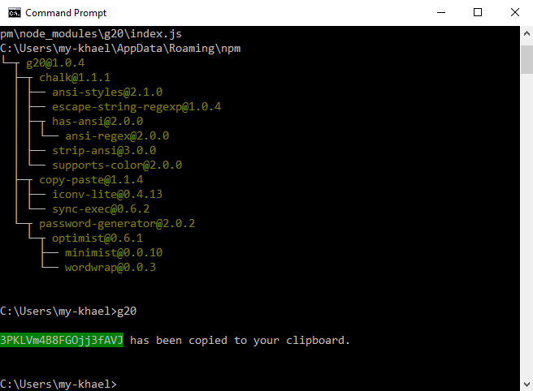

g20 v1.0.5
====
[](https://travis-ci.org/jdorfman/g20)

g20 (Generate a 20 Character Password) is the fastest and easiest cross-platform CLI password generator on the planet.  For years I have been using [something similar to it](https://medium.com/@jdorfman/osx-password-generator-in-bash-48687892c4f3#.ex5p9qiig) but it only works on OS X.  Feel free to [submit an issue](https://github.com/jdorfman/g20/issues) if you're stuck.

### Installation
`npm install -g g20`

### Usage

```
$ g20

WgVxD9LXdRyfv8t3D_V has been copied to your clipboard.

```

### Platform Support
|OS X|Linux¹|Win²|
|---|---|---|
| ✅ | ✅ | ✅|

¹ For Linux make sure `xclip` is installed e.g. `sudo apt-get install xclip`

² Tested on Windows 10

### FAQ's

> Can I generate a password **longer** than 20 characters?

No.

> Can I generate a password **shorter** than 20 characters?

No.

> Can I customize the background color to my liking?

No.

**Bottom line**: all customizations require a fork.  And if you want, I will link to your fork in this `README.md`

### Screenshots



### Dependency Packages

* [`Chalk`](https://www.npmjs.com/package/chalk) - MIT © Sindre Sorhus
* [`password-generator`](https://www.npmjs.com/package/password-generator) - MIT © 2011-2012 Bermi Ferrer
* [`copy-paste`](https://www.npmjs.com/package/copy-paste) - MIT © Xavi Ramirez
