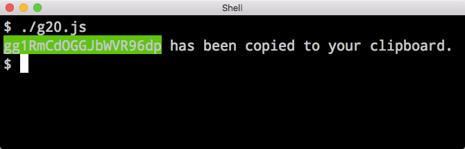

g20 v1.0.3-beta
====

g20 (Generate a 20 Character Password) is the fastest and easiest cross-platform CLI password generator on the planet.  For years I have been using [something similar to it](https://medium.com/@jdorfman/osx-password-generator-in-bash-48687892c4f3#.ex5p9qiig) but it only works on OS X.  During the beta I ask others to help test other OS platforms.

### Installation
`npm install -g g20`

### Usage

```
$ g20

WgVxD9LXdRyfv8t3D_V has been copied to your clipboard.

```

### Platform Support
|OS X|Linux|Win|
|---|---|---|
| ✅ | ❓ | ❓|

### FAQ's

> Can I generate a password **longer** than 20 characters?

No.

> Can I generate a password **shorter** than 20 characters?

No.

> Can I customize the background color to my liking?

No.

**Bottom line**: all customizations require a fork.

### Screenshot


### Dependency Packages

* [`Chalk`](https://www.npmjs.com/package/chalk) - MIT © Sindre Sorhus
* [`password-generator`](https://www.npmjs.com/package/password-generator) - MIT © 2011-2012 Bermi Ferrer
* [`copy-paste`](https://www.npmjs.com/package/copy-past) - MIT © Xavi Ramirez
